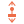

#  `MovementControlsUpDown` component

Applies up and down movement to a [`MovementVelocity`](MovementVelocity.md) component.

## How to use

1. Attach the `MovementControlsUpDown` component to your scene.  It is recommended to add this as a child of the `MovementVelocity` to control.
2. Select the `MovementVelocity` node to control in `velocity_node`.  You can skip this step if the parent is the `MovementVelocity`.
3. Create new (or import existing) `InputEventAction` resources for `input_action_up` and `input_action_down`.  Set the relevant `action` for each to the input actions you wish to use.  These input actions should already be defined in Project Settings.  

If no `InputEventAction`s are specified for `input_action_up` and/or `input_action_down`, they will default to using the built-in `ui_up` and `ui_down` input actions respectively.

This component can be combined with [`MovementControlsLeftRight`](MovementControlsLeftRight.md) to provide four-way movement.  Four-way movement is also provided for by [`MovementControlsFourWay`](MovementControlsFourWay.md).

