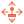

# The components

## State Management

-  [`SimpleStateMachineComponent`](simple_state_machine.md) - A simple state machine implementation that uses simple specifically-named methods to manage state.

## Stats

-  [`StatComponent`](stat.md) - Keep track of an arbitrary numerical statistic (stat).
	-  [`AutoRecoverComponent`](auto_recover.md) - Give a `StatComponent` the ability to autorecover over time..
-  [`HealthComponent`](health.md) - Keep track of a health-like numerical statistic (stat)..
	-  [`AutoHealComponent`](auto_heal.md) - Give a `HealthComponent` the ability to autoheal over time.

## Movement

-  [`VelocityComponent`](velocity.md) - Control a `CharacterBody2D` node, applying a maximum speed with acceleration and deceleration coefficients.
-  [`MovementControlsLeftRight`](controls_left_right.md) - Applies left and right movement to a `VelocityComponent`.
-  [`MovementControlsUpDown`](controls_up_down.md) - Applies up and down movement to a `VelocityComponent`.
-  [`MovementControlsFourWay`](controls_four_way.md) - Applies directional four-way movement to a `VelocityComponent`.

## Visual

-  [`PlaceholderComponent`](placeholder.md) - A visual placeholder component.
-  [`LookAtCursorComponent`](look_at_cursor.md) - Rotates a Node2D to "look" at the cursor.
-  [`LookAtNodeComponent`](look_at_node.md) - Rotates a Node2D to "look" at another Node2D.
-  [`AlignToVelocityComponent`](align_to_velocity.md) - Align a node to a [`VelocityComponent`](velocity.md) component.

## Effects

-  [`BounceComponent`](bounce.md) - Add a bouncing effect to a `Node2D`.
-  [`FlashComponent`](flash.md) - Add a flash effect to a `Node2D`.
-  [`FlashOnHitComponent`](flash_on_hit.md) - Add a flash effect to a `Node2D`, triggered by a collision with a [`HurtboxComponent`](hurtbox.md).

## Interactions

-  [`HitboxComponent`](hitbox.md) - A simple hitbox component.
-  [`HurtboxComponent`](hurtbox.md) - A simple hurtbox component.

